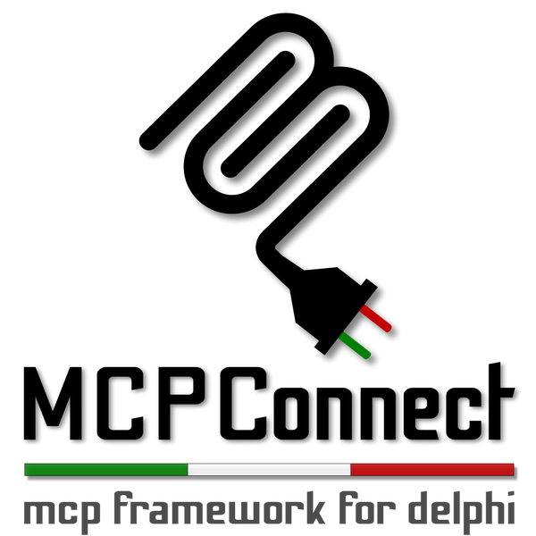

<p align="center">
  
</p>

# 🔌 MCPConnect: A Delphi MCP Server Library

**A powerful, attribute-driven framework for building Model Context Protocol (MCP) Servers in Delphi.**

-----

## ✨ What is MCP?

The Model Context Protocol (MCP) is an open standard for connecting large language models (LLMs) to external tools and data.

It enables AI models to go beyond their training data by accessing new information, performing actions, and interacting with tools and databases.

With MCP servers you can:
* Provide functionality through `Tools` (used to execute code or otherwise produce a side effect)
* Expose data through `Resources` (used to load information into the LLM’s context)
* Define interaction through `Prompts` (reusable templates for LLM interactions)

## ⚡ Highlights

**Delphi MCP Connect (MCPConnect)** is a lightweight yet robust framework designed to drastically simplify the creation of **Model Context Protocol (MCP) Servers** using Embarcadero Delphi. By leveraging the power of **Attributes**, the framework allows developers to re-use existing business logic and standard Delphi classes, turning them into protocol-aware server components with minimal boilerplate code.
MCPConnect handles the serialization, routing, and context management required for the server-side implementation of the MCP protocol.

- 🛡️**Type safety** - Define your tool arguments as native delphi class or records, have mcp-connect handle the rest.
- 🚛 **Transports** - Use the built-in transport: HTTP for stateless communication (with stdio already in development).
- ⚡ **Low boilerplate** - mcp-connect generates all the MCP endpoints for you apart from your tools, prompts and resources.


-----

## 🚀 Key Features

  * **Attribute-Driven Development:** Simply register classes to automatically discover tools, resources, and prompts using the **`[McpTool], [McpResource], [McpPrompt]`** attributes to expose specific methods.
  * **Standard Code Re-use:** Easily expose existing business logic classes without heavy modification or complex inheritance hierarchies.
  * **Automatic Routing:** The framework automatically scans and registers methods decorated with the appropriate attributes, handling all request routing.
  * **Easy-to-use** classes for tools, prompts, and resources
  * **API-Key** authentication for http transport (more to be implemented)
  * **JSON-RPC** MCPConnect contains a JSON-RPC library (`JRPC`) a comprehensive, high-performance **JSON-RPC 2.0** library built specifically for Delphi.
 *  **Automatic JSON Schema generation** - Using the powerful Neon TSchemaGenaerator, MCPConnect support any Delphi type as parameter or result. 
  

## 📡What is JSON-RPC?

JSON-RPC is a stateless, light-weight remote procedure call (RPC) protocol. Primarily this specification defines several data structures and the rules around their processing. It is transport agnostic in that the concepts can be used within the same process, over sockets, over http, or in many various message passing environments. It uses JSON (RFC 4627) as data format and it is designed to be simple!

### JRPC for Delphi
Inside MCPConnect you can find a complete implementation of the JSON-RPC v2.0 protocol that can be used independently of MCPConnect for all types of Delphi projects. This library empowers you to focus purely on your application logic, allowing you to define your remote APIs using simple Delphi class methods and attributes. Whether you are creating a client to consume external RPC services or exposing your own high-performance server methods, **JRPC** makes complex distributed computing simple, declarative, and fast.

The main features of JRPC are:

* **Automatic Marshaling**: Seamless conversion of Delphi objects into JSON-RPC requests and responses.
* **Broad Delphi types support**: Using Neon, JRPC supports virtually every Delphi type as Request parameters or result
* **Protocol Compliance**: Full adherence to the JSON-RPC 2.0 specification.

-----

## 🛠️ Installation

### Requirements

  * Delphi **10 or newer** (support for Attributes is essential).
  * Neon as Serialization Engine (https://github.com/paolo-rossi/delphi-neon)

### Getting Started

1.  **Clone Neon the Repository:**
    ```bash
    git clone https://github.com/paolo-rossi/delphi-neon
    ```
3.  **Clone MCPConnect the Repository:**
    ```bash
    git clone https://github.com/delphi-blocks/MCPConnect.git
    ```
3.  **Add to Project Path:** Add the `Source` directory of the cloned repositories to your Delphi Project's search path.
4.  **Integrate:** Reference the core units, such as `MCPConnect.JRPC.Core` and `MCPConnect.MCP.Attributes`, in your server project.

-----

## 💡 Usage Example

Creating an MCP-enabled service is as simple as adding the required attributes to a standard Delphi class and methods.

### 1. Create a New MCP Server Application

To get started with your MCP server, you'll need to set up a WebBroker application and configure the JSON-RPC components.

#### Step 1: Create a WebBroker Application

1. In Delphi, create a new **WebBroker Application** project (File → New → Other → Web → Web Server Application).
2. Choose your preferred web server type (standalone, ISAPI, Apache, etc.). For development, a standalone application is recommended.

> **Note:** While you can use Indy components directly, WebBroker provides a simpler and more straightforward approach for HTTP-based MCP servers.

#### Step 2: Configure the Server Components

In your WebModule's `OnCreate` event or constructor, create and configure the `TJRPCServer` and `TJRPCDispatcher` components:

```delphi
uses
  MCPConnect.JRPC.Server, 
  MCPConnect.MCP.Server.Api, // This register the standard MCP API
  MCPConnect.Transport.WebBroker, 
  MCPConnect.Configuration.MCP,
  
  Demo.HelpDeskService; // Unit with your MCP classes

// Create the JSON-RPC Server
FJRPCServer := TJRPCServer.Create(Self);
FJRPCServer
  .Plugin.Configure<IMCPConfig>
    .SetServerName('delphi-mcp-server')
    .SetServerVersion('2.0.0')
    .RegisterToolClass(THelpDeskService)  // Register your tool class
    .ApplyConfig;

// Create and configure the Dispatcher
FJRPCDispatcher := TJRPCDispatcher.Create(Self); // Self should be the TWebModule
FJRPCDispatcher.PathInfo := '/mcp';  // Set the endpoint path
FJRPCDispatcher.Server := FJRPCServer;  // Connect to the server
```

#### Step 3: Understand the Automatic Integration

The `TJRPCDispatcher` integrates seamlessly with WebBroker through Delphi's standard component ownership mechanism:

1. **Automatic Registration**: When you create the dispatcher with `TWebModule` as its owner (via the constructor parameter), it automatically registers itself with the WebBroker framework.

2. **Request Routing**: For each incoming HTTP request, WebBroker checks all registered dispatchers to determine which one should handle it based on the `PathInfo` property.

3. **No Manual Wiring Needed**: Since the dispatcher was created with `Self` (the WebModule) as owner in Step 2, the connection is already established.

```delphi
// This line (from Step 2) does all the wiring:
FJRPCDispatcher := TJRPCDispatcher.Create(Self); // Self = TWebModule
// ↑ The owner parameter registers the dispatcher automatically
```

**That's it!** Your MCP server is now ready to accept JSON-RPC requests at the configured endpoint.

**Example**: If your server runs on port 8080, requests sent to `http://localhost:8080/mcp` will be automatically routed to your registered MCP tools.

### 2. Define Your Service (Model)

Register the class (the **Model**) and use the **`[McpTool]`** attribute for the methods (the **Tools** or actions).

```delphi
unit Demo.HelpDeskService;

interface

uses
  System.SysUtils, 
  MCPConnect.MCP.Attributes;

type
  THelpDeskService = class
  public
    // This method is published as an MCP tool
    [McpTool('doclist', 'List all the available documents')]
    function ListDocument(
      [McpParam('category', 'Document Category')] const ACategory: string
    ): TContentList;
    
    // This method is NOT exposed because it lacks the [McpTool] attribute
    procedure InternalStuff;
  end;
```

-----------------------------

### 3. Organizing Tools with Namespaces

When building larger MCP servers with multiple tool classes, you can organize them using **namespaces** to avoid name conflicts and improve API structure.

#### Why Use Namespaces?

- **Avoid conflicts**: Multiple tool classes can have methods with the same name
- **Clear organization**: Group related tools together logically
- **Better API structure**: Tools are exposed as `namespace_toolname` (e.g., `auth_login`, `user_get`)
- **Scalability**: Easy to add/remove entire feature sets

#### Basic Namespace Usage

```delphi
// Multiple tool classes with namespaces
FJRPCServer
  .Plugin.Configure<IMCPConfig>
    .SetServerName('multi-service-server')
    .RegisterToolClass('auth', TAuthService)       // auth_login, auth_logout
    .RegisterToolClass('tickets', TTicketService)  // tickets_list, tickets_create
    .RegisterToolClass('users', TUserService)      // users_get, users_update
    .ApplyConfig;
```

**Important**: Tool names must match the MCP pattern `^[a-zA-Z0-9_-]{1,64}$` (only alphanumeric, underscore, hyphen).

#### Custom Separator

The default separator is `_` (underscore), but you can change it to `-` (hyphen):

```delphi
FJRPCServer
  .Plugin.Configure<IMCPConfig>
    .SetNamespaceSeparator('-')  // Use hyphen instead of underscore
    .RegisterToolClass('auth', TAuthService)
    .ApplyConfig;
// Tools exposed as: auth-login, auth-logout
```

#### Mixed Approach

You can mix namespaced and non-namespaced tools:

```delphi
FJRPCServer
  .Plugin.Configure<IMCPConfig>
    .RegisterToolClass(TGeneralTools)        // health_check, version (no namespace)
    .RegisterToolClass('admin', TAdminTools) // admin_restart, admin_config
    .ApplyConfig;
```

**Note**: If you have overlapping namespaces (e.g., `delphi` and `delphi_day`), the framework matches the **longest/most specific** namespace first.

-----------------------------

### 4. Connecting LLM Clients to Your MCP Server

Once your MCP server is running, you need to configure your LLM client to connect to it. Below are configuration examples for popular clients.

#### Prerequisites

Before configuring any client, ensure:
1. Your MCP server is running and accessible (e.g., `http://localhost:8080/mcp`)
2. You know the authentication token if your server requires one
3. The endpoint path matches your `TJRPCDispatcher.PathInfo` setting

#### LM Studio Configuration

LM Studio supports HTTP-based MCP servers natively. Add the following configuration to your LM Studio settings:

**Configuration file location:**
- Windows: `%USERPROFILE%\.lmstudio\mcp.json`
- macOS/Linux: `~/.lmstudio/mcp.json`

**Configuration:**
```json
{
  "mcpServers": {
    "delphi-mcp-server": {
      "url": "http://localhost:8080/mcp",
      "headers": {
        "Authorization": "Bearer my-secret-token"
      }
    }
  }
}
```

**Configuration Parameters:**
- `delphi-mcp-server`: A unique identifier for your server (can be any name)
- `url`: The full URL to your MCP server endpoint
- `headers`: Optional HTTP headers (e.g., for authentication)

After saving the configuration, restart LM Studio to load the new MCP server.

#### Claude Desktop Configuration

Claude Desktop currently requires an intermediate tool called `mcp-remote` to connect to HTTP-based MCP servers, as it doesn't support HTTP transport natively yet.

##### Step 1: Test the Connection (Recommended)

Before configuring Claude Desktop, verify that `mcp-remote` can connect to your server:

```bash
npx mcp-remote http://localhost:8080/mcp --header "Authorization: Bearer my-secret-token"
```

If the connection is successful, you should see your server's capabilities listed.

##### Step 2: Configure Claude Desktop

**Configuration file location:**
- Windows: `%APPDATA%\Claude\claude_desktop_config.json`
- macOS: `~/Library/Application Support/Claude/claude_desktop_config.json`

**Configuration:**
```json
{
  "mcpServers": {
    "my-demo-server": {
      "command": "C:\\Program Files\\nodejs\\npx",
      "args": [
        "-y",
        "mcp-remote",
        "http://localhost:8080/mcp",
        "--header",
        "Authorization: Bearer my-secret-token"
      ]
    }
  }
}
```

**Configuration Parameters:**
- `my-demo-server`: A unique identifier for your server
- `command`: Path to the Node.js `npx` executable
  - Windows: `C:\\Program Files\\nodejs\\npx` (note the double backslashes)
  - macOS/Linux: `/usr/local/bin/npx` or `npx` (if in PATH)
- `args`: Arguments passed to `npx`:
  - `-y`: Auto-confirm package installation
  - `mcp-remote`: The bridge tool for HTTP transport
  - URL to your MCP server
  - `--header`: Optional authentication header

##### Step 3: Restart Claude Desktop

After saving the configuration, restart Claude Desktop to load the MCP server connection.

-----

## Testing

MCPConnect servers can be tested using different approaches, depending on your testing needs and preferences.

### Low-Level Testing with HTTP Clients

For low-level protocol testing, you can use standard HTTP clients like **Bruno** or **Postman** to send JSON-RPC requests directly to your MCP server endpoint.

**Example test files for Bruno** are already available in the `demo/api` directory of this repository. These files demonstrate how to structure JSON-RPC calls for testing various MCP operations.

### Testing with MCPJam Inspector

For a more specialized testing experience, you can use **MCPJam Inspector**, a tool specifically designed for testing and debugging MCP servers. MCPJam provides a web-based interface that makes it easy to explore your server's capabilities and test its tools interactively.

#### Quick Start with MCPJam

To launch MCPJam Inspector, simply run:

```bash
npx @mcpjam/inspector@latest
```

This command will:
1. Download the latest version of MCPJam Inspector
2. Start the local server
3. Open a web interface where you can add and test your MCP server

From the web interface, you can add your Delphi MCP server by providing its endpoint URL (e.g., `http://localhost:8080/mcp`) and start testing your tools immediately.

-----

## 🤝 Contributing

We welcome contributions\! If you have suggestions, bug reports, or want to contribute code, please:

1.  Fork the repository.
2.  Create a new branch (`git checkout -b feature/AmazingFeature`).
3.  Commit your changes (`git commit -m 'Add some AmazingFeature'`).
4.  Push to the branch (`git push origin feature/AmazingFeature`).
5.  Open a **Pull Request**.

-----

## 📄 License

Distributed under the **MIT License**. See `LICENSE` for more information.
