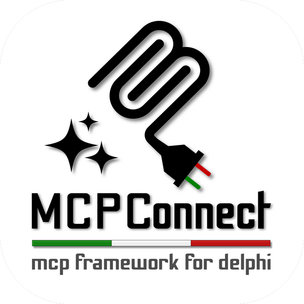

<p align="center">
  
</p>

# 🔌 MCPConnect: A Delphi MCP Server Library

**A powerful, attribute-driven framework for building Model Context Protocol (MCP) Servers in Delphi.**

> [!NOTE]
> Support for the MCP specification version **2026-07-28** is under development in the [`feature/mcp-2026-07-28`](https://github.com/delphi-blocks/MCPConnect/tree/feature/mcp-2026-07-28) branch. The protocol entity layer is complete there — discovery, completion, elicitation schemas, subscriptions, notifications, MRTR and the new error codes — with the transport still to follow. That revision is stateless: the `initialize` handshake and `Mcp-Session-Id` sessions have been removed from that branch, along with SSE resumption over HTTP GET.

## Getting Started

Please follow the documentation at [mcpconnect.delphiblocks.dev](https://mcpconnect.delphiblocks.dev/)!

-----

## ✨ What is MCP?

The Model Context Protocol (MCP) is an open standard for connecting large language models (LLMs) to external tools and data.

It enables AI models to go beyond their training data by accessing new information, performing actions, and interacting with tools and databases.

With MCP servers you can:
* Provide functionality through `Tools` (used to execute code or otherwise produce a side effect)
* Expose data through `Resources` (used to load information into the LLM’s context)
* Define interaction through `Prompts` (reusable templates for LLM interactions)

## ⚡ Highlights

**Delphi MCP Connect (MCPConnect)** is a lightweight yet robust framework designed to drastically simplify the creation of **Model Context Protocol (MCP) Servers** using Embarcadero Delphi. By leveraging the power of **Attributes**, the framework allows developers to re-use existing business logic and standard Delphi classes, turning them into protocol-aware server components with minimal boilerplate code.
MCPConnect handles the serialization, routing, and context management required for the server-side implementation of the MCP protocol.

- 🛡️**Type safety** - Define your tool arguments as native delphi class or records, have mcp-connect handle the rest.
- 🚛 **Transports** - Built-in HTTP (WebBroker, Indy) and STDIO transports for both stateless and persistent connections.
- 🔐 **OAuth 2.1** — Built-in support for OAuth 2.1 bearer-token authentication following the MCP Authorization specification, with pluggable token validators, JWKS key management, and a metadata proxy for providers that don't fully advertise PKCE support.
- ⚡ **Low boilerplate** - mcp-connect generates all the MCP endpoints for you apart from your tools, prompts and resources.

-----

## 💡 Usage Example

Creating an MCP-enabled service is as simple as adding the required attributes to a standard Delphi class and methods.

Register the class (the **Model**) and use the **`[McpTool]`** attribute for the methods (the **Tools** or actions).

```delphi
unit Demo.HelpDeskService;

interface

uses
  System.SysUtils, 
  MCPConnect.MCP.Attributes;

type
  THelpDeskService = class
  public
    // This method is published as an MCP tool
    [McpTool('doclist', 'List all the available documents')]
    function ListDocument(
      [McpParam('category', 'Document Category')] const ACategory: string
    ): TContentList;
    
    // This method is NOT exposed because it lacks the [McpTool] attribute
    procedure InternalStuff;
  end;
```

-----

## 🤖 Claude Code Plugin

A [Claude Code](https://claude.com/claude-code) plugin for MCPConnect is available from the [delphi-blocks/claude-plugins](https://github.com/delphi-blocks/claude-plugins) marketplace. Installing it teaches Claude Code how MCPConnect actually works — transports, attributes, the fluent configuration, notifications and OAuth — so it can scaffold a new server or add tools, resources and prompts to an existing one without you pasting the API in every time.

```
/plugin marketplace add delphi-blocks/claude-plugins
/plugin install mcpconnect@delphi-blocks
```

The skill activates on its own whenever you are working with MCPConnect.

-----

## 🤝 Contributing

We welcome contributions\! If you have suggestions, bug reports, or want to contribute code, please:

1.  Fork the repository.
2.  Create a new branch (`git checkout -b feature/AmazingFeature`).
3.  Commit your changes (`git commit -m 'Add some AmazingFeature'`).
4.  Push to the branch (`git push origin feature/AmazingFeature`).
5.  Open a **Pull Request**.

-----

## 📄 License

Distributed under the **MIT License**. See `LICENSE` for more information.
